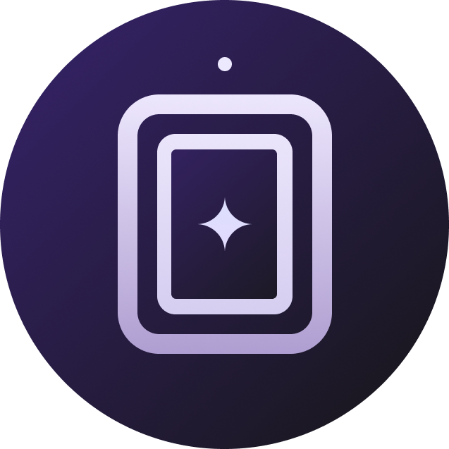
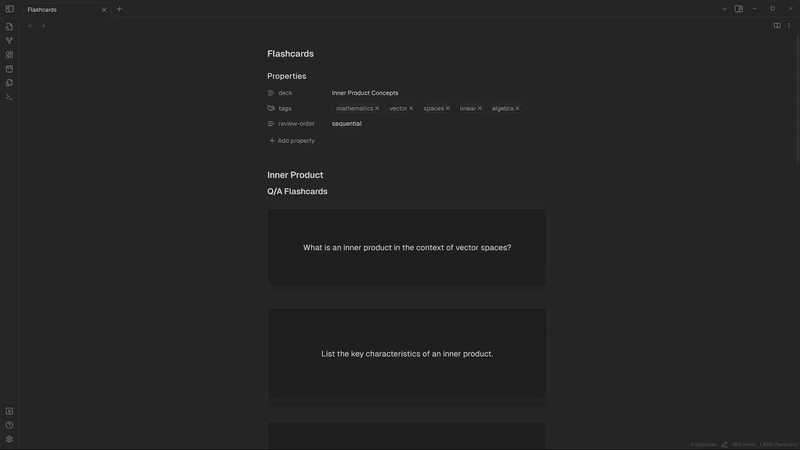

<h3 align="center">
	<br/>
	
	Simple Flashcards for <a href="https://obsidian.md/">Obsidian</a>
</h3>

<p align="center">
Display interactive flashcards to formulate knowledge 🧠
  <br>
</p>

<p align="center">
    <a href="https://github.com/Railly/one-hunter-vscode/stargazers"></a>
    <a href="https://marketplace.visualstudio.com/items?itemName=RaillyHugo.one-hunter"></a>
</p>

## Features

🗃️ Standard Q&A flashcards  
🎴 Cloze deletion flashcards for active recall  
🔁 Customizable reveal methods (hover, button click, surface click)  
🖋️ Inline cloze deletion with `{{word}}` syntax  
🧠 Markdown support within code blocks.

## How to use it?

1. Insert a code block with the `flashcard` language tag.
2. Create a Q&A flashcard:

````markdown
```flashcard
Q: What is Obsidian?
A: Obsidian is a powerful knowledge base that works on top of a local folder of plain text Markdown files.
```
````

3. Create a cloze deletion flashcard::

````markdown
```flashcard
{{Obsidian}} is a powerful knowledge base that works on top of a local folder of plain text {{Markdown}} files.
```
````

4. Click on the flashcard to reveal the answer.
5. Optionally, configure the reveal method in the plugin settings.

## Demo



## How to install

1. Install this plugin within Obsidian:

    - Open Settings > Community plugins
    - Make sure Safe mode is off
    - Click Browse community plugins
    - Search for "**Simple Flashcards**"
    - Click Install
    - Once installed, close the community plugins window and activate the newly installed plugin

2. Configure the plugin to your liking via the plugin settings accessible from the Obsidian settings panel.

## Contributing

Contributions are always welcome, whether in the form of bug reports, bug fixes, or feature ideas. Feel free to open an issue to discuss potential features or submit pull requests.

## Support

If you find this plugin helpful and wish to support ongoing development, consider buying me a coffee. Your support is greatly appreciated!

[](https://github.com/sponsors/Railly)
